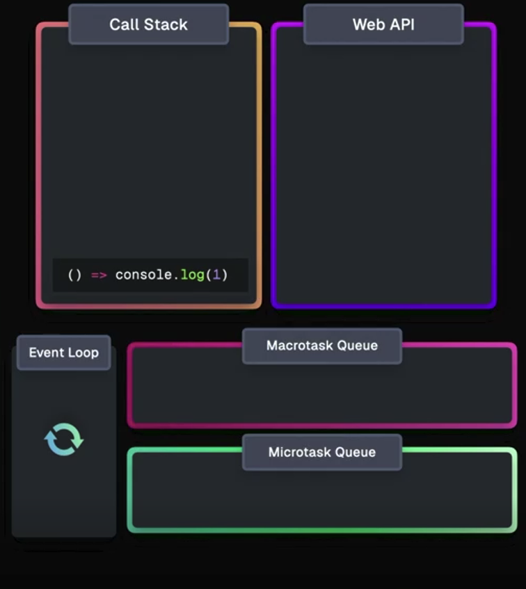

<!-- _class: lead -->

# Asynchronous JavaScript

<style>
section.lead h1 {
  text-align: center;
  font-size: 2.5em;
}
</style>

---


# Program:
- Synchronous vs Asynchronous
- I/O tasks vs CPU tasks
- Blocking vs Non-blocking
- Single-threaded vs Multi-threaded
- Callbacks
- Promises
- Async/Await
- Event Loop

---

# JavaScript definition

## JavaScript is a **single-threaded**, **synchronous language** defined by the ECMAScript specification. It executes code on a **single call stack**, one operation at a time.

**JavaScript does not have built-in I/O capabilities**. Instead, it relies on the **Runtime Environment** to provide these features.

---

# JavaScript Runtime Environment

## In the **runtime environment**, JavaScript remains single-threaded and synchronous, but gains **non-blocking**, **asynchronous** behavior through host-provided APIs and the event loop.

**These APIs allow JavaScript to perform tasks like network requests, timers, and DOM manipulation without blocking the main thread.**

---

# Synchronous vs Asynchronous

**Synchronous:**
Code runs one line at a time, in order. Each task waits for the previous one to finish.


**Asynchronous:**
Code can start tasks and move on before they finish. Results are handled later (in JavaScript with **callbacks** or **promises**).

---

# I/O tasks vs CPU tasks

**I/O tasks:**
Reading files, **network requests**, database queries (often slow, can be async)

**CPU tasks:**
Calculations, data processing (use CPU, usually sync)

---

# Blocking vs Non-blocking

**Blocking**: 
The program waits for a task to finish before moving on (e.g., a long calculation).

**Non-blocking**:
The program continues running while the task is handled in the background; the result is processed later (e.g., a timer or network request).

---

# Single-threaded vs Multi-threaded

**Single-threaded:**
One thread with one call stack — tasks run sequentially, one at a time (e.g., JavaScript in browsers).

**Multi-threaded:**
Multiple threads with separate call stacks — tasks can run in parallel (e.g., Java, or JavaScript with Web Workers).

---

# JavaScript concurrency model

- JavaScript uses a single-threaded event loop
- Handles async tasks via callbacks, promises, and async/await
- Non-blocking I/O lets JS handle many tasks efficiently

---

# Callbacks

**A callback is just a function passed as an argument to another function, to be *“called back”* later.**

```js
function doSomething(callback) {
    console.log('Doing something...');
    callback();
}

function myFunction() {
    console.log('Inside the callback!');
}

// Usage
doSomething(myFunction);
```

---

# Callbacks continued

```js
function doSomething(callback) {
    console.log('Doing something...');
    callback();
}

// Usage
doSomething(() => console.log('Inside the callback!'));
```

**This is the same example, but using a lambda (arrow) function as a callback!**

---

# Callbacks and async work

**Callbacks are often used for async tasks, like timers or network requests.**


**Definition of `setTimeout`:**
```js
setTimeout(callback, msToWait);
```

**Example:**
```js
setTimeout(callback, 1000);

function callback() {
  console.log('This runs later');
}
```

---

# Callbacks and async work (contd.)

**The same example as before, but with different syntax!**


Using an **anonymous function**:
```js
setTimeout(function() {
  console.log('This runs later');
}, 1000);
```

Using an **arrow function** (or lambda):
```js
setTimeout(() => console.log('This runs later'), 1000);
```

---

# Problems with callbacks

Using callbacks can lead to **"callback hell"** or **"pyramid of doom"** when nesting multiple async operations:

```js
setTimeout(() => {
    console.log("Step 1 complete");
    setTimeout(() => {
        console.log("Step 2 complete");
        setTimeout(() => {
            console.log("Step 3 complete");
            setTimeout(() => {
                console.log("All steps complete");
            }, 1000);
        }, 1000);
    }, 1000);
}, 1000);
```

---

# Problems with callbacks (contd.)

**This nesting makes code hard to read and maintain.**

Furthermore it **tightly couples each async step** to the previous one, making error handling difficult.

The code is not modular, and reusing parts of it is challenging.

**SOLUTION**: Use **Promises** to manage async operations more cleanly.

---

# Promises

A **Promise** is an object representing the eventual result of an async operation.

A promise has three states: **pending**, **fulfilled**, or **rejected**.

The **Promise constructor** takes a function with two parameters: `resolve` and `reject`.

```js
const myPromise = new Promise((resolve, reject) => {
    // Do some async work...
    // If successful, it calls: resolve(param)
    // If error, it calls: reject(error)
});
```
---

# Using Promises

**We can rewrite the previous callback (hell) example using `Promise`:**
```js
function asyncTask(message) {
    return new Promise(resolve => {
        setTimeout(() => {
            console.log(message);
            resolve();
        }, 1000);
    });
}

asyncTask("Step 1 complete")
    .then(() => asyncTask("Step 2 complete"))
    .then(() => asyncTask("Step 3 complete"))
    .then(() => asyncTask("All steps complete"));
```

---

# Chaining Promises

**The code inside `.then()` is executed when the promise is fulfilled.**

**The `.then()` method itself returns a new promise.**

The return value of a promise like `resolve(param)`, is `param`, and it is passed to the next `.then()` in the chain.

---

# Error handling with Promises

Sometimes async operations fail, like network errors etc.

Use `.catch()` to handle errors in promise chains.

```js
asyncTask("Step 1 complete")
    .then(() => asyncTask("Step 2 complete"))
    .then(() => asyncTask("Step 3 complete"))
    .then(() => asyncTask("All steps complete"))
    .catch(error => console.error("Error:", error));
```

**`.catch()` will catch any error thrown in the promise chain.**

**An error is thrown by calling `reject(error)` inside the promise.**

---

# `async`/`await`

- Are keywords in JavaScript, which make working with promises easier.
- Syntactic sugar for working with promises
- Makes async code look like sync code!

```js
async function doTasks() {
    await asyncTask("Step 1 complete");
    await asyncTask("Step 2 complete");
    await asyncTask("Step 3 complete");
    await asyncTask("All steps complete");
}
```

---

# Using `async`/`await`

- The `async` keyword before a function means it always returns a promise.
- The `await` keyword makes JavaScript wait until the promise settles, and returns its result.
- When using an async function, we need to either use `.then()` or `await` to get the result.

```js
function initApp() {
    doTasks().then(() => console.log("All tasks done!"));
}
// or
async function initApp() {
    await doTasks();
    console.log("All tasks done!");
}
```

---

# Event Loop

The mechanism that handles async operations in JavaScript

Picks tasks from queues and puts them on the call stack when ready

Ensures non-blocking behavior while keeping JS single-threaded


---

# Call Stack

- The place where JS keeps track of what function is currently running
- Functions are added (pushed) and removed (popped) as they start and finish

---

# Event Loop (contd.)

- Some tasks (like I/O) are handled outside the main thread by the runtime environment (browser).

- **Tasks are queued in different queues** (callback queue, microtask queue, rendering queue).

---

<!-- _class: img-60 -->

<!--  -->


<style>
    section.img-60 {
        display: flex;
        align-items: center;
    }
section.img-60 img{
  width: 600px;
}
</style>

---

# Example

**What will be the output of this code? Why?**

```js
console.log("A");

setTimeout(() => {
    console.log("B");
}, 0);

Promise.resolve().then(() => console.log("C"));

fetch('https://jsonplaceholder.typicode.com/posts/1').then(() => console.log("D"))

console.log("E");
```
